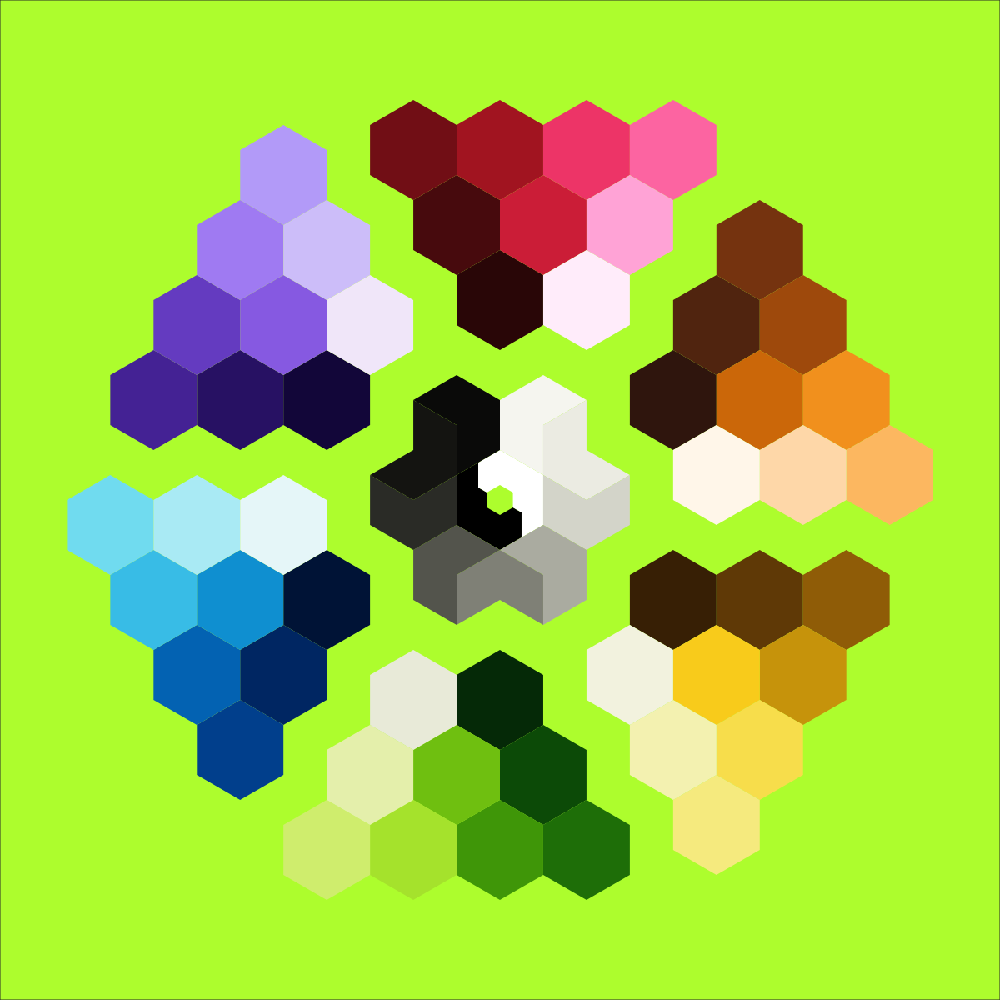

# Felix Color Palette

## Theory

The color "felix" is not one that can can be quantified by a hex RGB value, or pigments, or even wavelengths of light.

It is an idea.

It is the boldest, brightest, most vibrant intersection of green and yellow.

These colors are very close to "felix":

- Lime
- Avocado
- Chartreuse
- Neon green

I'm currently using: `#adff2f` (r173, g255, b47) for it, but I've tweaked it a few times.

From there I built out a color palette to use with my stuffs.

## Inspiration

- Monokai
- Tailwind
- Styled System
- Palettte.app

## Development

`yarn dev`
`yarn build`
`yarn publish`
